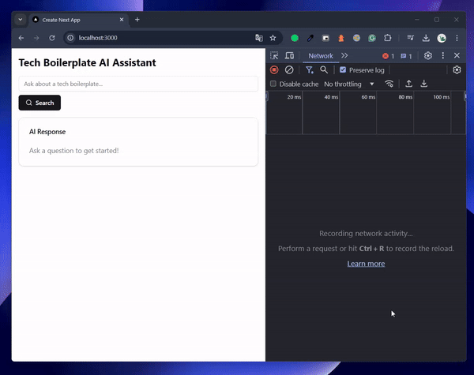

# AI-Powered Question Answering System

## Description

This project is an innovative question-answering system that leverages the power of Large Language Models (LLMs) and vector databases to provide accurate and context-aware responses. It uses cutting-edge technologies to enhance information retrieval and natural language processing capabilities.

## Demo

Check out the project in action:

  

## Key Features

- Integration with a powerful LLM API for natural language understanding and generation
- Utilization of a vector database for efficient and semantic information retrieval
- Context-aware responses based on the queried information
- Scalable architecture to handle large volumes of data and concurrent requests

## How It Works

1. User submits a question through the API
2. The system processes the question and searches the vector database for relevant information
3. Retrieved context is sent to the LLM along with the original question
4. LLM generates a comprehensive answer based on the provided context and question
5. The system returns the answer to the user

## Getting Started

[Basic instructions for setting up and running the project]

## API Documentation

[Link to or brief overview of the API endpoints and usage]

## Contributing

Contributions are welcome! Please read the contribution guidelines before submitting a pull request.

## License

This project is licensed under [license type]. See the LICENSE file for more details.
